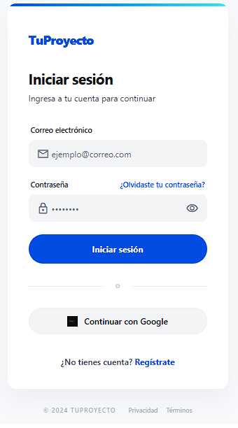
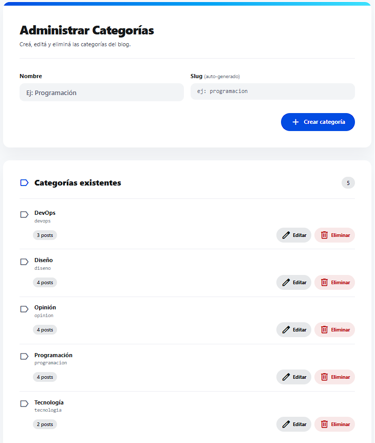

***REMOVED*** FS-0002 — Amplix Blog

***REMOVED******REMOVED*** 📖 Descripción

Amplix es una aplicación web de blog de noticias y contenido tecnológico. Los usuarios pueden registrarse, publicar artículos, comentar y reaccionar al contenido de otros. La plataforma incluye un sistema de autenticación con roles diferenciados: los administradores pueden gestionar y moderar contenido, mientras que los usuarios cuentan con un perfil que centraliza sus publicaciones e interacciones.

El contenido está organizado por categorías temáticas (Programación, Diseño, Testing, DevOps) y puede filtrarse para facilitar la navegación.

---

***REMOVED******REMOVED*** 🛠️ Tech Stack

| Capa                  | Tecnología                     |
|-----------------------|--------------------------------|
| Frontend              | React + Vite                   |
| Backend               | Node.js + Express              |
| Base de datos         | Prisma Postgres (nube)         |
| ORM                   | Prisma + Prisma Accelerate     |
| Auth                  | JWT (JSON Web Tokens)          |
| Estilos               | Tailwind CSS / CSS Modules     |
| Almacenamiento        | Cloudinary                     |
| Control de versiones  | Git (GitHub Flow)              |

---

***REMOVED******REMOVED*** 📸 Screenshots

***REMOVED******REMOVED******REMOVED*** 🔐 Login


---

***REMOVED******REMOVED******REMOVED*** 🏠 Página Principal


---

***REMOVED******REMOVED******REMOVED*** 🔍 Filtro de Búsqueda


---

***REMOVED******REMOVED******REMOVED*** 📝 Creación de Post


---

***REMOVED******REMOVED******REMOVED*** 🗒️ Detalle de Post


---

***REMOVED******REMOVED******REMOVED*** ⚙️ Dashboard Admin


---

***REMOVED******REMOVED******REMOVED*** 🗂️ Administración de Categorías


---

***REMOVED******REMOVED******REMOVED*** 👤 Creación de Usuario


---

***REMOVED******REMOVED*** 📋 Requisitos previos

- [Node.js](https://nodejs.org/) v24.16 LTS
- [Git](https://git-scm.com/)

---

***REMOVED******REMOVED*** 🔐 Variables de entorno

Antes de instalar, pedile al equipo los archivos `.env` correspondientes y ubicalos en:

- `backend/.env`
- `frontend/amplix-blog/.env`

---

***REMOVED******REMOVED*** 🚀 Instalación y configuración

***REMOVED******REMOVED******REMOVED*** 1. Clonar el repositorio

```bash
git clone https://github.com/amplixme/FS-0002.git
cd FS-0002
```

---

***REMOVED******REMOVED******REMOVED*** 2. Backend

```bash
cd backend
npm install
npm run dev
```

Servidor disponible en: `http://localhost:3000`

---

***REMOVED******REMOVED******REMOVED*** 3. Frontend

Abrí una nueva terminal desde la raíz del proyecto:

```bash
cd frontend/amplix-blog
npm install
npm run dev
```

Frontend disponible en: `http://localhost:5173`

---

***REMOVED******REMOVED*** 📁 Estructura del proyecto
FS-0002/

├── backend/

│   ├── prisma/

│   │   └── migrations/

│   └── src/

│       ├── tests/

│       ├── config/

│       ├── controllers/

│       ├── generated/

│       │   └── prisma/

│       ├── middlewares/

│       ├── routes/

│       ├── schemas/

│       ├── services/

│       └── utils/

├── frontend/

│   └── amplix-blog/

│       ├── public/

│       └── src/

│           ├── tests/

│           ├── components/

│           │   ├── admin/

│           │   ├── categories/

│           │   ├── comments/

│           │   ├── common/

│           │   └── profile/

│           ├── context/

│           ├── hooks/

│           ├── pages/

│           ├── services/

│           └── utils/

└── README.md

---

***REMOVED******REMOVED*** 🌐 Producción

| Entorno            | URL